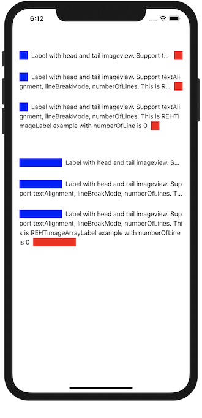

# REHTImageLabel

[](https://cocoapods.org/pods/REHTImageLabel)
[](https://cocoapods.org/pods/REHTImageLabel)
[](https://cocoapods.org/pods/REHTImageLabel)



## Example

To run the example project, clone the repo, and run `pod install` from the Example directory first.

## Requirements

## Installation

REHTImageLabel is available through [CocoaPods](https://cocoapods.org). To install
it, simply add the following line to your Podfile:

```ruby
pod 'REHTImageLabel'
```

## Author

roceun, roceun@gmail.com

## License

REHTImageLabel is available under the MIT license. See the LICENSE file for more info.
